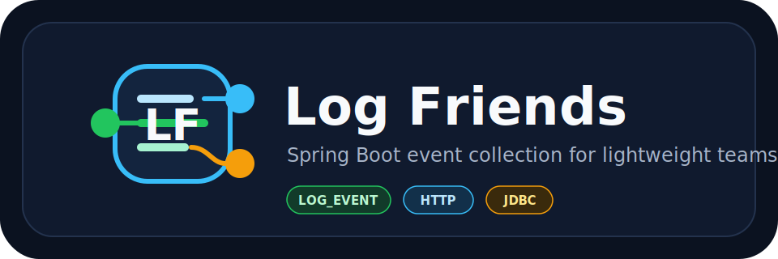

<p align="center">
  
</p>

# Log Friends

**Languages:** [English](#english) | [한국어](#korean) | [日本語](#japanese) | [Deutsch](#deutsch) | [Português do Brasil](#portugues-do-brasil) | [中文](#中文)

**Primary target stack:** Java / Kotlin, Spring Boot, PostgreSQL / TimescaleDB

## English

Log Friends is a lightweight event collection platform for Spring Boot applications. It is designed for teams running Java/Spring services who want to store Raw Events, inspect business `LOG_EVENT.eventName` flows, and build first-phase analytics without introducing a heavy observability or streaming stack.

```text
Spring Boot App + log-friends-sdk
  -> HTTP JSON batch POST /ingest
  -> log-friends-console
  -> PostgreSQL / TimescaleDB
  -> Dashboard / Log Catalog
```

The first-phase goal is intentionally small: Spring Boot apps send HTTP JSON batches directly to the Console, and the Console stores Raw Events and builds first-phase statistics with fewer operational components. That makes Log Friends a practical fit for small teams and Java/Spring-heavy environments such as Korea, Japan, Germany, US enterprise systems, India, China, Eastern Europe, and Brazil.

### Product Idea

Log Friends is not trying to replace Datadog or New Relic.

The first users are backend engineers, data engineers, and data platform operators who need a simple way to see what eventName flows out of each Spring Boot app.

The main differentiator is the Log Catalog. It connects intended LogSpec contracts with recent real samples, mismatch warnings, and field requests:

```text
LogSpec + Recent Sample + Mismatch + Field Request
```

Data engineers can inspect what each app emits before asking backend engineers for contract changes. Backend engineers still own LogSpec, eventName contracts, and code changes.

### Architecture

```text
Target Spring Boot App
  + log-friends-sdk
      - ByteBuddy instrumentation
      - bounded in-memory queue
      - JSON batch transport
      - masking before send
        |
        | POST /ingest
        v
log-friends-console
  - Raw Event ingest
  - Agent / Worker management
  - Log Catalog API + static UI
  - scheduler-based statistics
        |
        v
PostgreSQL / TimescaleDB
```

### Event Types

| eventType | Stored in | Description |
|---|---|---|
| `LOG_EVENT` | `custom_events` | Business eventName captured from `@LogEvent` |
| `LOG` | `logs` | Logback logs |
| `HTTP` | `http_events` | HTTP request/response metadata |
| `JDBC` | `jdbc_events` | JDBC execution metadata |
| `METHOD_TRACE` | `method_traces` | Spring `@Service` method duration |

`LOG_EVENT.eventName` is required and must be camelCase. Invalid `LOG_EVENT` values are not sent by the SDK; the target app logs a warning instead.

### Repositories

| Repository | Role |
|---|---|
| [log-friends-sdk](https://github.com/log-freind/log-friends-sdk) | Captures events inside Spring Boot apps and sends them to Console `/ingest` |
| [log-friends-console](https://github.com/log-freind/log-friends-console) | Ingest, storage, Agent management, Log Catalog, statistics |
| [log-friends-examples](https://github.com/log-freind/log-friends-examples) | Example Spring Boot applications |

### SDK Quick Start

```kotlin
dependencies {
    implementation("com.logfriends:log-friends-sdk:1.2.0")
}
```

Required configuration:

```bash
export LOGFRIENDS_WORKER_ID=order-api-local-1
export LOGFRIENDS_INGEST_URL=http://localhost:8082/ingest
```

JVM attach option:

```bash
java -Djdk.attach.allowAttachSelf=true -jar your-app.jar
```

If required settings are missing, the SDK disables capture/transport without failing the target app.

### First-Phase Policy

- SDK transport is HTTP JSON `POST /ingest`.
- `workerId` and `ingestUrl` are required.
- SDK transport failures never fail the target app.
- Queue full or transport failure drops the batch and logs periodic warnings.
- SDK does not auto-register LogSpec.
- Console owns Raw Event storage and statistics generation.
- Console first-phase UI is Spring Boot static HTML with lightweight JavaScript.

---

## Korean

Log Friends는 Spring Boot 앱에서 발생하는 `LOG_EVENT`, `LOG`, `HTTP`, `JDBC`, `METHOD_TRACE` eventType을 SDK로 수집하고, Console에서 Raw Event와 eventName 흐름을 탐색할 수 있게 만드는 경량 수집 플랫폼입니다.

```text
Spring Boot App + log-friends-sdk
  -> HTTP JSON batch POST /ingest
  -> log-friends-console
  -> PostgreSQL / TimescaleDB
  -> Dashboard / Log Catalog
```

1차 목표는 운영 구성 요소를 줄이는 것입니다. Spring Boot 앱에서 Console로 직접 HTTP JSON batch를 보내고, 작은 팀도 Raw Event 저장과 기본 통계 흐름을 만들 수 있게 합니다.

### 제품 방향

Log Friends는 Datadog이나 New Relic을 대체하려는 대형 Observability 제품이 아닙니다.

1차 사용자는 제한된 리소스 안에서 앱별 eventName 흐름과 최근 payload 샘플을 확인하고 싶은 백엔드 엔지니어, 데이터 엔지니어, 데이터 플랫폼 운영자입니다.

Log Friends는 국가별 사용량 순위를 주장하기보다, Java/Spring Boot 기반 엔터프라이즈 백엔드가 많은 환경을 주요 타깃으로 봅니다. 예를 들어 한국, 일본, 독일, 미국 엔터프라이즈, 인도, 중국, 동유럽, 브라질처럼 Spring Boot 서비스와 사내 운영 시스템이 많은 시장에서는, 무거운 Observability 스택 없이 앱별 eventName 흐름을 확인하려는 요구가 생길 수 있습니다.

핵심 차별점은 Log Catalog입니다.

```text
LogSpec + Recent Sample + Mismatch + Field Request
```

데이터 엔지니어는 Log Catalog에서 Recent Sample과 Mismatch를 확인하고 필요한 field를 요청할 수 있습니다. 백엔드 엔지니어는 LogSpec, eventName 계약, 코드 변경의 소유권을 유지합니다.

### 아키텍처

```text
Target Spring Boot App
  + log-friends-sdk
      - ByteBuddy instrumentation
      - bounded in-memory queue
      - JSON batch transport
      - masking before send
        |
        | POST /ingest
        v
log-friends-console
  - Raw Event ingest
  - Agent / Worker management
  - Log Catalog API + static UI
  - scheduler-based statistics
        |
        v
PostgreSQL / TimescaleDB
```

### Event Types

| eventType | 저장 대상 | 설명 |
|---|---|---|
| `LOG_EVENT` | `custom_events` | `@LogEvent` 기반 비즈니스 eventName |
| `LOG` | `logs` | Logback 로그 |
| `HTTP` | `http_events` | HTTP 요청/응답 메타데이터 |
| `JDBC` | `jdbc_events` | JDBC 실행 메타데이터 |
| `METHOD_TRACE` | `method_traces` | Spring `@Service` 메서드 실행 시간 |

`LOG_EVENT.eventName`은 camelCase 필수입니다. 유효하지 않은 `LOG_EVENT`는 SDK에서 전송하지 않고 대상 앱 로그에 warn을 남깁니다.

### Repositories

| Repository | Role |
|---|---|
| [log-friends-sdk](https://github.com/log-freind/log-friends-sdk) | Spring Boot 앱 내부에서 이벤트를 캡처하고 Console `/ingest`로 전송 |
| [log-friends-console](https://github.com/log-freind/log-friends-console) | 이벤트 수신, 저장, Agent 관리, Log Catalog, 통계 생성 |
| [log-friends-examples](https://github.com/log-freind/log-friends-examples) | SDK/Console 연동 예제 앱 |

### SDK Quick Start

```kotlin
dependencies {
    implementation("com.logfriends:log-friends-sdk:1.2.0")
}
```

필수 설정:

```bash
export LOGFRIENDS_WORKER_ID=order-api-local-1
export LOGFRIENDS_INGEST_URL=http://localhost:8082/ingest
```

JVM attach 옵션:

```bash
java -Djdk.attach.allowAttachSelf=true -jar your-app.jar
```

설정이 없으면 SDK는 앱을 죽이지 않고 캡처/전송을 비활성화합니다.

### 1차 정책

- SDK transport는 HTTP JSON `POST /ingest`입니다.
- `workerId`와 `ingestUrl`은 필수 설정입니다.
- SDK 전송 실패는 대상 앱을 실패시키지 않습니다.
- queue full 또는 전송 실패 시 batch는 drop하며, 주기적으로 warn을 남깁니다.
- SDK는 LogSpec을 자동 등록하지 않습니다.
- Console이 Raw Event 저장과 통계 생성을 담당합니다.
- Console 1차 UI는 Spring Boot static HTML + 가벼운 JavaScript입니다.

---

## Japanese

Log Friends は、Spring Boot アプリケーションで発生する `LOG_EVENT`, `LOG`, `HTTP`, `JDBC`, `METHOD_TRACE` eventType を SDK で収集し、Console で Raw Event と eventName の流れを確認できる軽量な収集プラットフォームです。

```text
Spring Boot App + log-friends-sdk
  -> HTTP JSON batch POST /ingest
  -> log-friends-console
  -> PostgreSQL / TimescaleDB
  -> Dashboard / Log Catalog
```

第1フェーズの目標は、運用コンポーネントを増やさないことです。Spring Boot アプリから Console に直接 HTTP JSON batch を送り、Raw Event 保存と基本統計の流れを小さく始めます。

### Product Direction

Log Friends は Datadog や New Relic を置き換える大型 Observability 製品ではありません。

主な対象は、限られたリソースの中でアプリごとの eventName の流れと最近の payload サンプルを確認したいバックエンドエンジニア、データエンジニア、データ基盤運用者です。

国別の利用ランキングを主張するのではなく、Java/Spring Boot ベースのエンタープライズバックエンドが多い環境を主な対象としています。日本、韓国、ドイツ、米国エンタープライズ、インド、中国、東欧、ブラジルのような市場では、重い Observability スタックなしで app ごとの eventName を確認したいニーズが生まれやすいです。

Log Catalog は次の要素をまとめて扱います。

```text
LogSpec + Recent Sample + Mismatch + Field Request
```

### Repositories

| Repository | Role |
|---|---|
| [log-friends-sdk](https://github.com/log-freind/log-friends-sdk) | Spring Boot アプリ内でイベントをキャプチャし、Console `/ingest` に送信 |
| [log-friends-console](https://github.com/log-freind/log-friends-console) | ingest, storage, Agent management, Log Catalog, statistics |
| [log-friends-examples](https://github.com/log-freind/log-friends-examples) | SDK / Console 連携サンプル |

### SDK Quick Start

```kotlin
dependencies {
    implementation("com.logfriends:log-friends-sdk:1.2.0")
}
```

```bash
export LOGFRIENDS_WORKER_ID=order-api-local-1
export LOGFRIENDS_INGEST_URL=http://localhost:8082/ingest
java -Djdk.attach.allowAttachSelf=true -jar your-app.jar
```

---

## Deutsch

Log Friends ist eine leichtgewichtige Event-Collection-Plattform fuer Spring-Boot-Anwendungen. Das SDK sammelt `LOG_EVENT`, `LOG`, `HTTP`, `JDBC` und `METHOD_TRACE` eventTypes und macht Raw Events sowie eventName-Fluesse in der Console sichtbar.

```text
Spring Boot App + log-friends-sdk
  -> HTTP JSON batch POST /ingest
  -> log-friends-console
  -> PostgreSQL / TimescaleDB
  -> Dashboard / Log Catalog
```

Das Ziel der ersten Phase ist eine kleine Betriebsflaeche: Spring-Boot-Apps senden HTTP JSON batches direkt an die Console, damit Raw Events und erste Statistiken mit wenigen Betriebsbausteinen verfuegbar sind.

### Product Direction

Log Friends ersetzt keine grossen Observability-Plattformen wie Datadog oder New Relic.

Die ersten Nutzer sind Backend Engineers, Data Engineers und Data Platform Operators, die mit begrenzten Ressourcen eventName-Fluesse und aktuelle payload samples pro App sehen wollen.

Log Friends ist besonders passend fuer Enterprise-Java/Spring-Umgebungen, wie sie haeufig in Deutschland, Korea, Japan, US-Enterprise-Systemen, Indien, China, Osteuropa und Brasilien vorkommen. Das ist keine Laender-Rangliste, sondern eine Zielumgebung: viele Spring-Boot-Services, interne Systeme und Bedarf an leichtem Self-Hosting.

Der Log Catalog verbindet:

```text
LogSpec + Recent Sample + Mismatch + Field Request
```

### Repositories

| Repository | Role |
|---|---|
| [log-friends-sdk](https://github.com/log-freind/log-friends-sdk) | Captures events inside Spring Boot apps and sends them to Console `/ingest` |
| [log-friends-console](https://github.com/log-freind/log-friends-console) | Ingest, storage, Agent management, Log Catalog, statistics |
| [log-friends-examples](https://github.com/log-freind/log-friends-examples) | Example Spring Boot applications |

### SDK Quick Start

```kotlin
dependencies {
    implementation("com.logfriends:log-friends-sdk:1.2.0")
}
```

```bash
export LOGFRIENDS_WORKER_ID=order-api-local-1
export LOGFRIENDS_INGEST_URL=http://localhost:8082/ingest
java -Djdk.attach.allowAttachSelf=true -jar your-app.jar
```

---

## Portugues do Brasil

Log Friends e uma plataforma leve de coleta para aplicacoes Spring Boot. O SDK coleta os eventTypes `LOG_EVENT`, `LOG`, `HTTP`, `JDBC` e `METHOD_TRACE`, envia batches JSON para a Console e permite explorar Raw Events e fluxos de eventName.

```text
Spring Boot App + log-friends-sdk
  -> HTTP JSON batch POST /ingest
  -> log-friends-console
  -> PostgreSQL / TimescaleDB
  -> Dashboard / Log Catalog
```

O objetivo da primeira fase e reduzir componentes operacionais: a aplicacao Spring Boot envia HTTP JSON batches diretamente para a Console para armazenar Raw Events e iniciar estatisticas com poucos componentes.

### Product Direction

Log Friends nao tenta substituir plataformas grandes de Observability como Datadog ou New Relic.

Os primeiros usuarios sao backend engineers, data engineers e operadores de plataforma de dados que precisam ver fluxos de eventName e samples recentes de payload com poucos recursos.

Log Friends e pensado para ambientes enterprise Java/Spring Boot, comuns em mercados como Brasil, Coreia, Japao, Alemanha, sistemas enterprise dos EUA, India, China e Europa Oriental. Isso nao e um ranking por pais; e uma descricao do tipo de ambiente onde muitos servicos Spring Boot e sistemas internos precisam de coleta simples e self-hosted.

O Log Catalog conecta:

```text
LogSpec + Recent Sample + Mismatch + Field Request
```

### Repositories

| Repository | Role |
|---|---|
| [log-friends-sdk](https://github.com/log-freind/log-friends-sdk) | Captures events inside Spring Boot apps and sends them to Console `/ingest` |
| [log-friends-console](https://github.com/log-freind/log-friends-console) | Ingest, storage, Agent management, Log Catalog, statistics |
| [log-friends-examples](https://github.com/log-freind/log-friends-examples) | Example Spring Boot applications |

### SDK Quick Start

```kotlin
dependencies {
    implementation("com.logfriends:log-friends-sdk:1.2.0")
}
```

```bash
export LOGFRIENDS_WORKER_ID=order-api-local-1
export LOGFRIENDS_INGEST_URL=http://localhost:8082/ingest
java -Djdk.attach.allowAttachSelf=true -jar your-app.jar
```

---

## 中文

Log Friends 是面向 Spring Boot 应用的轻量级 event collection 平台。SDK 采集 `LOG_EVENT`, `LOG`, `HTTP`, `JDBC`, `METHOD_TRACE` eventType，通过 HTTP JSON batch 发送到 Console，并支持查看 Raw Event 与 eventName 流向。

```text
Spring Boot App + log-friends-sdk
  -> HTTP JSON batch POST /ingest
  -> log-friends-console
  -> PostgreSQL / TimescaleDB
  -> Dashboard / Log Catalog
```

第一阶段目标是减少运维组件：Spring Boot 应用直接向 Console 发送 HTTP JSON batch，用较少组件完成 Raw Event 存储和第一阶段统计流程。

### Product Direction

Log Friends 不是 Datadog 或 New Relic 这类大型 Observability 平台的替代品。

第一批用户是后端工程师、数据工程师和数据平台运维人员。他们希望在资源有限的情况下查看每个应用的 eventName 流向和最近的 payload sample。

Log Friends 更适合 Java/Spring Boot 企业后端环境，例如中国、韩国、日本、德国、美国企业系统、印度、东欧和巴西等市场。这里不是国家排名，而是指 Spring Boot 服务和内部系统较多、同时需要轻量自托管采集路径的环境。

Log Catalog 连接以下信息：

```text
LogSpec + Recent Sample + Mismatch + Field Request
```

### Repositories

| Repository | Role |
|---|---|
| [log-friends-sdk](https://github.com/log-freind/log-friends-sdk) | Captures events inside Spring Boot apps and sends them to Console `/ingest` |
| [log-friends-console](https://github.com/log-freind/log-friends-console) | Ingest, storage, Agent management, Log Catalog, statistics |
| [log-friends-examples](https://github.com/log-freind/log-friends-examples) | Example Spring Boot applications |

### SDK Quick Start

```kotlin
dependencies {
    implementation("com.logfriends:log-friends-sdk:1.2.0")
}
```

```bash
export LOGFRIENDS_WORKER_ID=order-api-local-1
export LOGFRIENDS_INGEST_URL=http://localhost:8082/ingest
java -Djdk.attach.allowAttachSelf=true -jar your-app.jar
```
